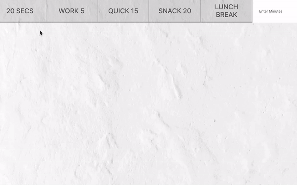

# 29. Countdown Timer

#### _Countdown Timer by JavaScript30 11/01/19_

## Description
This is Countdown Timer, 29th application out of 30 by 30 day Vanilla JavaScript Coding Challenge by Wes Bos.<br>
Please check the challenge from [JavaScript30](http://wesbos.com/javascript30/).



## About this Application
- Create a countdown timer.

- A user can click the fixed minutes button or type minutes in a form.

- Once the button is clicked or minutes is typed, the countdown timer starts counting down.

- The screen also will show what time the timer ends.

- If a user prefer to see military time instead of regular time, comment out the line 45 and 46 and uncomment the line 42  in `main.js`.


## Setup/Installation

1. Clone this repo:
```
$ git clone https://github.com/misakimichy/JS230-29-countdown-timer.git
```

2. Navigate to the top level of the cloned directory.

3. Open index.html with your preferred web browser.

## Known Bugs
* No known bugs at this time.

## Support and contact details
 I welcome any feedbacks and comments: misaki.koonce@gmail.com

## Technologies Used
_Git, GitHub, HTML, CSS, Vanilla JavaScript

## License
Copyright © 2019 under the MIT License